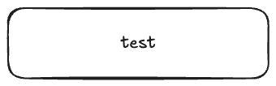

# Documentation assets (`doc/`)

This folder holds **static files** for image documentation that are not part of the container build context:

- **`images/`** — Screenshots, architecture diagrams, or icons referenced from the root [`README.md`](../README.md) or from the [documentation](https://github.com/HomeProjectSandbox/documentation) site.

Images here are **not** copied into the Docker image by default. Keep the application under `hello-world/` (or similar) for image contents.

For markdown in GitHub, use relative links, for example: ``.

Test png: 

fdssd